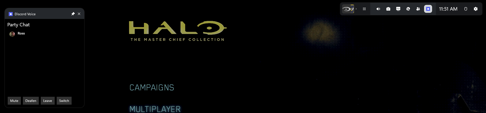
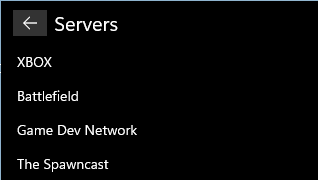
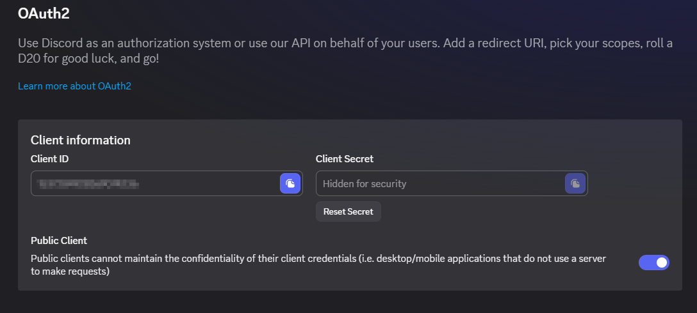
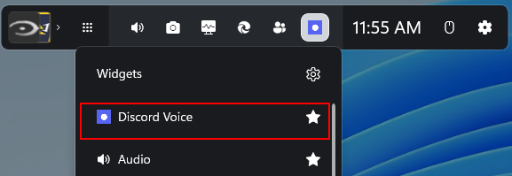

# DiscordXboxWidget

Discord voice controls inside the Xbox Game Bar. See who's in your channel, who's talking,
mute and deafen yourself, and hop between channels — without alt-tabbing out of a game.



## What it does

- **Live participant list** with avatars, server nicknames, and mute/deafen state
- **Speaking indicator** — a ring lights around whoever is talking
- **Mute and deafen** yourself without switching windows
- **Channel switching** — browse your servers and jump to another voice channel



## Requirements

- Windows 10 1903 (build 18362) or later
- The **Discord desktop client** running (the web app does not expose the local RPC socket)

## Install

### 1. Trust the signing certificate

Releases are signed with a self-signed certificate, so Windows needs to be told to trust it
before it will install the package. Download `DiscordXboxWidget.cer` from the
[latest release](https://github.com/terellison/DiscordXboxWidget/releases/latest) and, in an
**elevated** PowerShell:

```bash
Import-Certificate -FilePath .\DiscordXboxWidget.cer -CertStoreLocation Cert:\LocalMachine\TrustedPeople
```

This project cannot be distributed through the Microsoft Store (see
[Distribution](docs/architecture.md#distribution)), so there is no CA-issued signature to fall
back on. Inspect the certificate first if you would rather not take that on trust.

### 2. Install the package

Download **every file** attached to the release into the same folder, then:

```bash
Add-AppxPackage -Path .\DiscordXboxWidget_0.1.3.0_x64.msix -DependencyPath .\Microsoft.NET.Native.Framework.2.2.appx,.\Microsoft.NET.Native.Runtime.2.2.appx,.\Microsoft.VCLibs.x64.14.00.appx
```

The framework packages matter: Windows cannot fetch them from the Store for a sideloaded
app, and without them the install fails with `0x80073CF3`. If your machine already has them,
the extra arguments are harmless.

The package is around 43 MB because it carries its own .NET runtime. That is deliberate:
nothing about a sideloaded install can fetch a missing shared runtime, so the alternative
was a prerequisite you would discover by the widget not working.

### 3. Register a Discord application

A two-minute, one-time step. No application ID is shipped with the widget — Discord's
[Developer Terms](https://support-dev.discord.com/hc/en-us/articles/8562894815383) classify it
as a developer credential and forbid embedding those in open source projects. The upside is
that you grant permissions to an application **you** own rather than to someone else's.

1. Go to the [Discord Developer Portal](https://discord.com/developers/applications) and
   click **New Application**
2. Open the **OAuth2** tab
3. Enable **Public Client**
4. Add `http://localhost` under **Redirects** and save
5. Copy the **Application ID**

> Keeping the application under your own ownership is simplest — Discord grants an owner
> access to their own application automatically. If you put it in a **Team**, that stops:
> team-owned applications grant nobody access implicitly, and you must add yourself under
> **App Testers** or authorization fails with `invalid_scope`.



### 4. Point the widget at it

Press **Win+G**, open the widget menu, and pick **Discord Voice**.



On first launch it will say no application is configured. Click the **gear** in the widget's
title bar, paste your Application ID, and press **Save and connect**.

Discord then shows a consent dialog asking you to authorize your application. Accept it once;
the token is cached DPAPI-encrypted, so the prompt will not reappear.

The refresh button beside the controls reconnects at any time — useful if you started the
widget before Discord, or changed applications.

<details>
<summary>Editing the file directly instead</summary>

The same setting lives in `%LOCALAPPDATA%\DiscordXboxWidget\config.json`, written as a
template on first launch:

```json
{
  "clientId": "123456789012345678"
}
```

Press refresh in the widget afterwards, or reopen it, so the bridge picks up the change.

</details>

### If something goes wrong

The widget shows the reason in place of the channel name. Two logs carry the detail:

```bash
type "$env:LOCALAPPDATA\DiscordXboxWidget\bridge.log"
```

```bash
Get-ChildItem "$env:LOCALAPPDATA\Packages\DiscordXboxWidget_*\LocalState\widget.log"
```

| Symptom | Cause |
|---|---|
| `0x80073CFB` on install | A build deployed from Visual Studio is registered. `Remove-AppxPackage` it first — an unpackaged registration cannot be replaced by a packaged one |
| "No Discord application configured" | Step 4 — set the Application ID via the gear |
| `invalid_client` during authorization | **Public Client** not enabled on your app's OAuth2 tab |
| `invalid_scope` during authorization | The application is in a Team and your account is not under **App Testers**. Team-owned apps grant no implicit access, even to their own team |
| 4006 / not authorized | The Discord account in use does not own the application from step 3 |
| Widget missing from the Win+G menu | Package not installed, or Game Bar needs restarting |
| Empty participant list | Discord desktop client is not running |
| Stuck on "Connecting" | The bridge did not start; check `bridge.log` |

## Scope

Voice only — participants, speaking, mute/deafen, channel switching. No text chat, screen
share, or push-to-talk. See [the roadmap](docs/roadmap.md) for what that leaves and why.

## How it works, briefly

A Game Bar widget runs in an AppContainer, which cannot reach Discord's local RPC socket. So
the package ships a small full-trust process that does the RPC and talks to the widget over
`AppServiceConnection`.

That is a more roundabout design than it looks like it should be, for reasons worth reading
if you are building anything similar: [Architecture](docs/architecture.md).

## Documentation

| | |
|---|---|
| [Architecture](docs/architecture.md) | How the pieces fit, and why the bridge exists |
| [Development](docs/development.md) | Building, tests, the Discord harness, CI/CD, signing |
| [Game Bar notes](docs/game-bar-notes.md) | Platform traps, several contradicting Microsoft's docs |
| [Roadmap](docs/roadmap.md) | Known gaps and what is deliberately not planned |
| [Privacy policy](docs/privacy-policy.md) | What the app touches — it all stays on your PC |
| [Terms of service](docs/terms-of-service.md) | Licence, no warranty, no affiliation with Discord or Microsoft |

## Contributing

Issues and pull requests welcome. [Development](docs/development.md) covers the build, and
the harness lets you talk to Discord without going near Game Bar — usually the fastest way to
check whether a problem is yours or Discord's.

## Licence

See [LICENSE](LICENSE).

